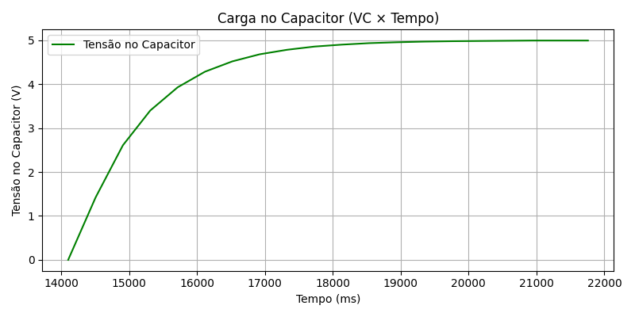
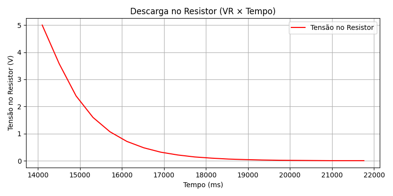
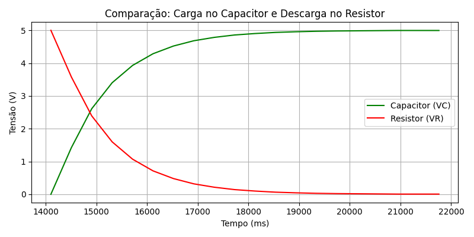

## Circuito RC — Prática
### Descrição da atividade

Nesta prática, foi estudado o comportamento de um circuito RC (resistor + capacitor) durante os processos de carga e descarga.
O objetivo foi observar como a tensão no capacitor e no resistor variam ao longo do tempo e comparar os resultados obtidos com os exemplos apresentados em aula.

### Coleta dos dados

Os valores de tensão foram obtidos a partir do Monitor Serial do Arduino. Esses dados foram então copiados e utilizados em um código em Python para gerar os gráficos de tensão em função do tempo.

### Gráfico da carga no capacitor (C)

Foi gerado um gráfico mostrando o comportamento da tensão no capacitor durante o processo de carga.
Observou-se que a tensão aumentou gradualmente com o tempo, como esperado para a carga de um capacitor em um circuito RC.

      <small><strong style="font-size: 12px;">FIGURA 1 - Gráfico da carga capacitor (c)</strong></small> 
       
      <small style="margin-top: 4px; font-size: 10px;">Fonte: Material produzido pela autora, 2025.</small> 

### Gráfico da descarga no resistor (R)

Em seguida, foi plotado o gráfico da tensão no resistor, que varia de forma complementar à do capacitor, diminuindo conforme o capacitor se carrega.

      <small><strong style="font-size: 12px;">FIGURA 1 - Gráfico da descarga (c)</strong></small> 
       
      <small style="margin-top: 4px; font-size: 10px;">Fonte: Material produzido pela autora, 2025.</small> 

### Comparação com o gráfico do slide

Os resultados não ficaram exatamente iguais ao exemplo apresentado no slide.
Isso ocorreu porque, no exemplo do slide o capacitor está descarregando, enquanto no meu circuito ele está carregando (e vice-versa).
Assim, as curvas apareceram invertidas em relação ao exemplo, mas o comportamento geral(exponencial e complementar) foi mantido, confirmando o funcionamento correto do circuito RC.

      <small><strong style="font-size: 12px;">FIGURA 3 - Gráfico de comparação entre os gráficos das figuras 1 e 2</strong></small> 
       
      <small style="margin-top: 4px; font-size: 10px;">Fonte: Material produzido pela autora, 2025.</small> 

### Materiais utilizados

- Arduino Uno R3

- Capacitor eletrolítico de 10 µF / 25 V;

- Resistores de 1 MΩ e 100Ω;

- Chave deslizante;

- Jumpers e protoboard.

### Código e dados

O código utilizado para geração dos gráficos encontra-se no arquivo **graphs.py** deste repositório.

O arquivo **dados.txt** é uma cópia do output obtido diretamente do Monitor Serial do Arduino, contendo os valores de tempo e tensão registrados durante o experimento.

### Simulador do circuito

Você pode acessar o simulador do circuito RC no Tinkercad pelo seguinte link:  
[Simulador Tinkercad - Circuito RC](https://www.tinkercad.com/things/h87WdqDEWvO-ponderada-prog-2?sharecode=HxXjV4JdVmLoXuoegXLGjEpl8krT3sHNpOJxXWLfqbg)

### Conclusão

O experimento permitiu observar a relação entre tensão, tempo e em um circuito RC. O comportamento observado está coerente com a teoria, comprovando a troca de energia entre o resistor e o capacitor nos processos de carga e descarga.